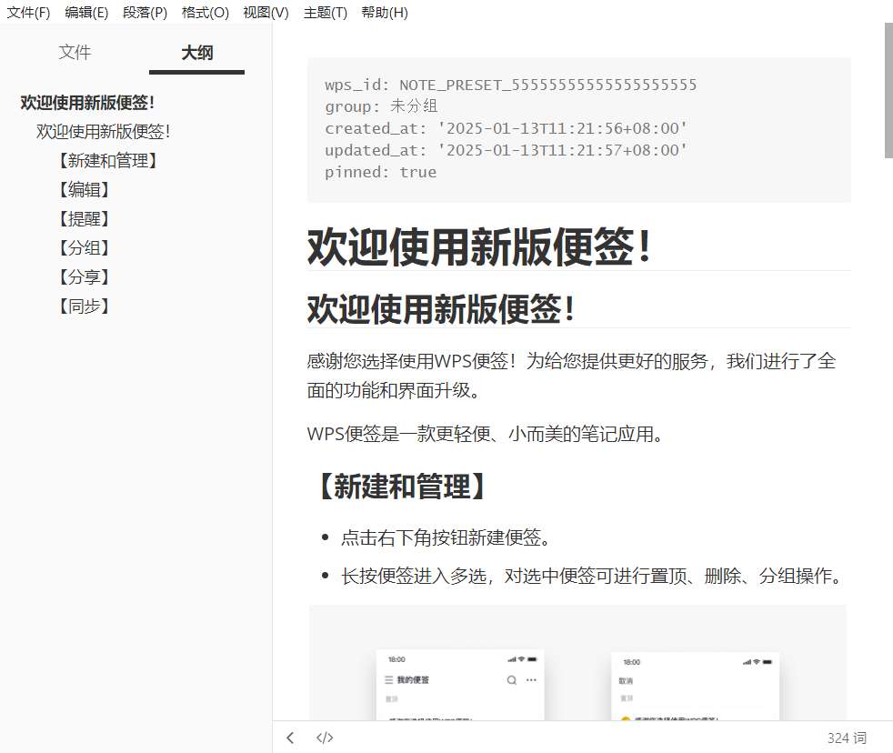

# WPS Notes Markdown Exporter

把旧版 [WPS 便签](https://note.wps.cn/) 导出为可人工检查的 Markdown、图片、YAML 元数据和 `manifest.json`，最后生成 ZIP。

工具只读取数据，不修改或删除 WPS 便签。默认启动一个临时浏览器会话，你在窗口里手工登录；关闭后登录 Cookie 不会落入本项目或导出包，账号、密码和正文解密材料也不会写盘。

## 安装

需要 Python 3.10 或更高版本：

```powershell
python -m pip install -r requirements.txt
python -m playwright install chromium
```

Windows 上如果没有安装 Playwright Chromium，默认模式会尝试使用本机 Microsoft Edge。

## 导出

```powershell
python export_wps_notes.py
```

浏览器打开后登录 WPS，脚本会自动继续。输出示例：

```text
output/
├── wps-notes-export-20260928-142000/
│   ├── manifest.json
│   ├── export-report.md
│   ├── 学习/
│   │   ├── 笔记标题.md
│   │   └── images/
│   └── 工作/
│       └── 另一篇笔记.md
└── wps-notes-export-20260928-142000.zip
```

常用选项：

```powershell
# 自定义输出位置
python export_wps_notes.py --output D:\Backups

# 连回收站一起导出
python export_wps_notes.py --include-recycle

# 只保留 ZIP
python export_wps_notes.py --zip-only

# 无需登录，先生成一份演示包检查格式
python export_wps_notes.py --demo

# 明确使用 Edge
python export_wps_notes.py --browser edge
```


## 数据与兼容性

每份 Markdown 都包含：

```yaml
---
wps_id: 原始便签ID
group: 学习
created_at: '2025-08-10T10:30:00+08:00'
updated_at: '2026-09-28T14:20:00+08:00'
pinned: false
---
```

内置的 BeautifulSoup 转换器可处理标题、段落、加粗、斜体、删除线、列表、Checklist、链接和图片。字体、字号、颜色、对齐、音频等无法无损映射的内容会写入 `export-report.md`。单条便签或图片失败不会中止整个批次。

WPS 网页内部接口不是公开 API，网站改版后可能需要调整。遇到问题可先设置调试环境变量，错误堆栈不包含 Cookie：

```powershell
$env:WPS_EXPORT_DEBUG = "1"
python export_wps_notes.py
```

官方已提示旧版便签将停止服务；迁移前请先处理其他账号、其他设备和回收站内容：[WPS 旧版便签迁移说明](https://bbs.wps.cn/topic/93428)。

## 示例效果



## 一次性合并到 Pluto Notes 备份

`import_wps_once.py` 不修改 Pluto Notes 应用代码、SQLite 数据库或任一输入 ZIP。它读取现有 Pluto 备份，将 WPS Markdown、分组和图片转换为当前 Pluto 备份格式，再生成一个新的合并备份。

先执行 dry-run：

```powershell
python import_wps_once.py `
  --wps-export "input\wps-notes-export-20260928-104144.zip" `
  --pluto-backup "input\20260928_031251_189_5704fda9.zip" `
  --output "output\pluto-notes-merged.zip" `
  --group-map "学习=知识库" `
  --group-map "工作=项目" `
  --dry-run
```

`--group-map` 的左侧是 WPS 原分组名，右侧是 Pluto Notes 目标分组名，可以重复指定。只有设置了映射的 WPS 分组才会导入；未配置映射的分组及其便签会被过滤并记录在报告中。同名映射可写成 `--group-map "学习=学习"`。

dry-run 会执行完整解析、UUID/分组映射、Markdown→Quill Delta、图片附件构造以及备份引用校验，但不会创建 `--output` 文件。确认报告无误后，使用完全相同的映射并去掉 `--dry-run`，才会生成正式备份：

```powershell
python import_wps_once.py `
  --wps-export "input\wps-notes-export-20260928-104144.zip" `
  --pluto-backup "input\20260928_031251_189_5704fda9.zip" `
  --output "output\pluto-notes-merged.zip" `
  --group-map "学习=知识库" `
  --group-map "工作=项目"
```

安全与合并规则：

- WPS 便签和新分组使用固定 namespace 的 UUIDv5，重复执行 ID 不变。
- WPS 分组必须显式配置映射；目标名与有效 Pluto 分组同名时复用，否则创建新分组。
- “未分组”也需显式映射，例如 `--group-map "未分组=收件箱"`。
- 原 Pluto 分组、便签、附件、设置及 ID 原样保留。
- 已存在的稳定 Note ID 内容相同则跳过；不同则生成确定性的冲突副本。
- 图片生成附件记录，并在 Delta 中使用 `attachment://{attachmentId}`。
- 所有时间转换为 UTC ISO 8601；保留创建、更新时间和置顶状态。
- 拒绝 Zip Slip、损坏 ZIP、非 Pluto 备份、无效附件引用和不完整关联。
- 正式输出先写同目录临时文件，通过等价于 `CloudBackupService._decode()` 的校验后才原子重命名。
- 输出已经存在时拒绝覆盖。

生成的正式 ZIP 除 `manifest.json`、`data.json` 和 `attachments/*` 外，还包含：

- `import-report.json`
- `import-report.md`

报告记录新增/复用分组、增加/跳过便签、冲突、附件和失败项，但不会记录便签正文或认证信息。

运行测试：

```powershell
python -m unittest discover -s tests -v
```
